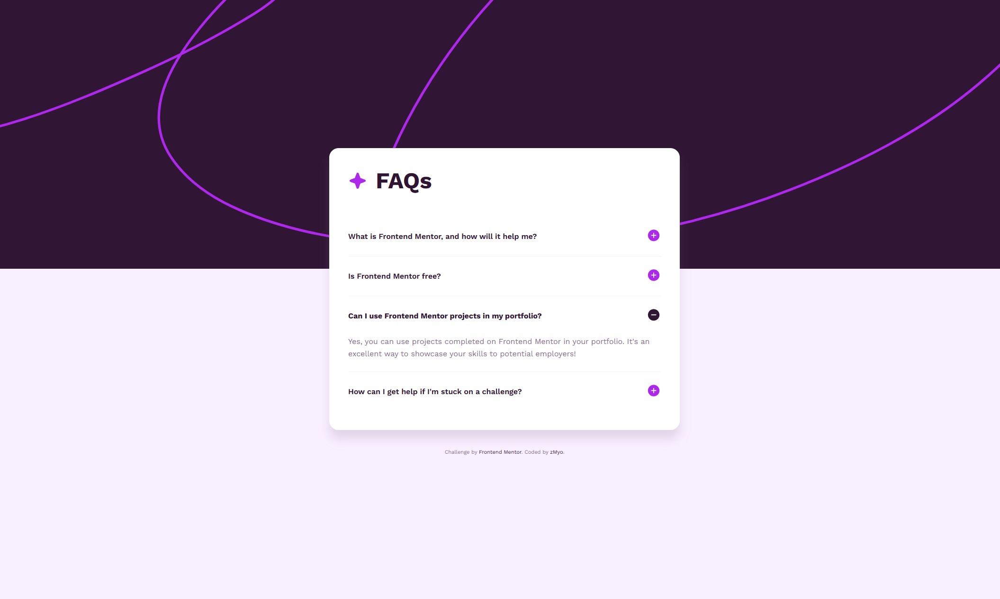

# Frontend Mentor - FAQ Accordion Solution

This is a solution to the [FAQ accordion challenge on Frontend Mentor](https://www.frontendmentor.io/challenges/faq-accordion-wyfFdeBwBw). Frontend Mentor challenges help you improve your coding skills by building realistic projects.

## Table of contents

- [Overview](#overview)
  - [The challenge](#the-challenge)
  - [Screenshot](#screenshot)
  - [Links](#links)
- [My process](#my-process)
  - [Built with](#built-with)
  - [Steps I followed](#steps-i-followed)
  - [What I learned](#what-i-learned)
  - [Continued development](#continued-development)
  - [Useful resources](#useful-resources)
- [Author](#author)
- [Acknowledgments](#acknowledgments)

## Overview

### The challenge

Users should be able to:

- View the optimal layout for the interface depending on their device's screen size
- See hover and focus states for all interactive elements
- Hide and show the answer to a question when the question is clicked
- Toggle between plus and minus icons when each question is opened/closed

### Screenshot

### Links

- Solution URL: [https://github.com/zMyo-gg/faq-accordion](https://github.com/zMyo-gg/faq-accordion)
- Live Site URL: [https://zmyo-gg.github.io/faq-accordion/](https://zmyo-gg.github.io/faq-accordion/)

## My process

### Built with

- Semantic HTML5 markup
- CSS custom properties and gradients
- CSS Flexbox for layout and alignment
- Smooth CSS transitions and animations
- Vanilla JavaScript for interactivity
- Mobile-first responsive design
- Work Sans font family (weights: 400, 600, 700)
- Decorative background patterns (desktop and mobile)

### Steps I followed

- First, I analyzed the desktop and mobile design files along with the style-guide.md to understand the color scheme, typography, layout, and interactive behavior requirements.
- I structured the HTML semantically using a `<ul>` list for FAQ items, `<button>` elements for questions, and proper ARIA attributes for accessibility (`aria-expanded`, `aria-controls`).
- background
  - **Desktop:** Uses `background-pattern-desktop.jpg` for large screens
  - **Mobile:** Switches to `background-pattern-mobile.jpg` at 768px breakpoint
- I styled the FAQ card with a white background, rounded corners, and box shadow to stand out against the gradient background.
- I built the accordion functionality using vanilla JavaScript:
  - Click handlers toggle the active state of FAQ items
  - Icon switching: Plus icon (`icon-plus.svg`) displays when closed, minus icon (`icon-minus.svg`) displays when open
  - Only one FAQ item can be open at a time (closing others automatically)
- I implemented smooth CSS transitions for the answer container using `max-height`, `opacity`, and `padding` properties to create a natural expand/collapse animation.
- I added hover states on buttons that change text color to Purple 600 for better user feedback.

### What I learned

- **Accordion Pattern Best Practices:** Managing multiple expandable items and ensuring only one is open at a time requires careful state management and DOM manipulation.
- **Dynamic Icon Switching:** Changing SVG icon sources based on state requires careful JavaScript handling to update the `src` attribute while maintaining performance.
- **Fixed Background Positioning:** Using `background-attachment: fixed` creates an engaging parallax effect that works well with decorative patterns.
- **Responsive Background Images:** Switching between different background image resolutions using media queries optimizes both visual appeal and page performance.
- **CSS Animation Timing:** Using `max-height` with `transition` for accordion animations is more performant than other approaches and creates smooth, natural-looking motion.
- **ARIA Attributes for Accessibility:** Proper use of `aria-expanded` and `aria-controls` ensures screen readers understand accordion state changes.

### Continued development

- Add smooth scroll-to-expanded item functionality when questions are clicked on mobile
- Create an animation when the page first loads (staggered reveal of FAQ items)
- Explore CSS animations with `@keyframes` for more sophisticated transitions
- Consider adding a search/filter feature to help users find specific FAQs
- Implement analytics to track which FAQs are most frequently viewed

### Useful resources

- [MDN: HTML Button Element](https://developer.mozilla.org/en-US/docs/Web/HTML/Element/button) - Essential for creating accessible accordion buttons.
- [MDN: ARIA: expanded Attribute](https://developer.mozilla.org/en-US/docs/Web/Accessibility/ARIA/Attributes/aria-expanded) - Understanding how to communicate accordion state to assistive technologies.
- [MDN: CSS Transitions](https://developer.mozilla.org/en-US/docs/Web/CSS/CSS_Transitions) - Core reference for smooth animations.
- [CSS-Tricks: A Complete Guide to Flexbox](https://css-tricks.com/snippets/css/a-guide-to-flexbox/) - Layout reference for positioning elements.
- [Frontend Mentor Style Guide](https://www.frontendmentor.io/challenges/faq-accordion-wyfFdeBwBw) - Exact specifications for colors, typography, and dimensions.
- [Web.dev: Accessible Components](https://web.dev/accessible-components/) - Best practices for keyboard navigation and ARIA attributes.

## Author

- Frontend Mentor - [zMyo-gg](https://www.frontendmentor.io/profile/zMyo-gg)
- Twitter/ X - [zMyo_gg](https://x.com/zMyo_gg)

## Acknowledgments

Thanks to Frontend Mentor for creating this accordion challenge that helped me practice JavaScript interactivity, CSS animations, and responsive design principles.
